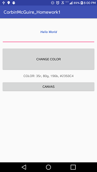
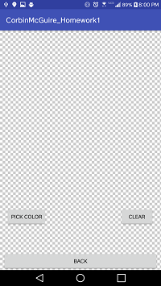
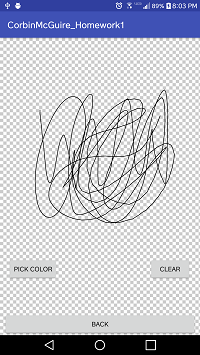
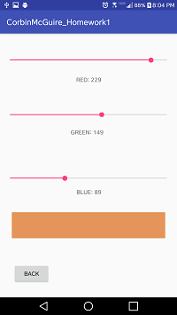
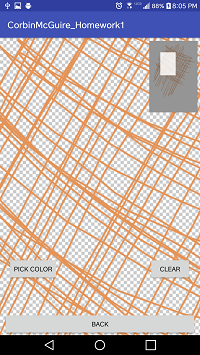

# CEG4410 Homework 1 - Drawing App
This is a simple drawing application that has multiple functionalities available to the user.

#### Dependencies
DrawView library from ByoxCode is installed: https://github.com/ByoxCode/DrawView.git
<p>Add this line to your build.gradle file:   </p>
```
implementation 'com.byox.drawview:drawview:1.3.1'
```


## How to Use
<ul>
  <li> On the main page, there is a text field to input any text specified by the user with two buttons that randomize the color of the text in the text field and take the user to the drawing page.</li>
  <li> The drawing page has a blank canvas for drawing and 3 buttons: one to return to the main page, one to change the brush color to a cutsom color, and one that clears the canvas of any marks.</li> 
  <li>The custom color page allows the user to create a custom color and apply it to the canvas upon return. </li>
</ul>

## Software Design
<link rel="stylesheet" href="style.css">
<p>For the main activity, the application creates 3 random values that serve as the red, green, and blue numerical values that get sent to a method that changes the color of the text in the text field. This seemed the most simple route because Java has an rgb() function that takes 3 integer values for each red/green/blue value. There is a formatter that converts the numerical values to the format specified in the assignment.</p>

<p>The Drawing Board acitivity implements functionality that allows data transfer between activities via Intents. Intents were used to get the custom color that the user specifies in the custom color activity. The drawing board also uses the restartDrawing() method to clear the screen. </p>
<div>
  
  
</div>
<p>The paint color picker activity used 3 seekBars that recorded the distance traveled and set individual RGB values via a method call each time the user stopped moving the bar. This was programmed such that the TextView on the screen would update in real-time to display the current color to the user.</p>
<div>
  
  
</div>

#### Known Bugs
<ul>
  <li>A new activity is started upon custom color creation. </li>
  <li>SeekBars in PaintColorPicker.java reset when first moving them. </li>
</ul>

#### Unimplemented Features
<ul>
  <li>Ability to save image</li>
</ul>
